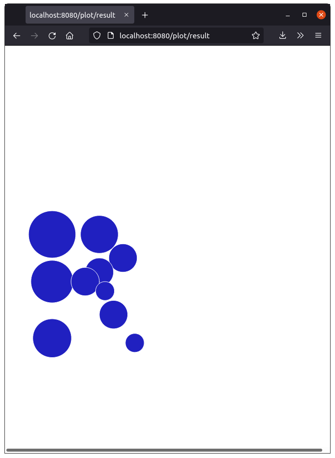

⚠WIP⚠ An example using extendr inside a simple API server ⚠WIP⚠
====================================================

## Usage

### Server

```sh
# On Windows, you need to `cargo run --target x86_64-pc-windows-gnu`
cargo run
```

Disclaimer: I don't find how to stop this server properly yet. Currently I do `pkill extendr-tide-ap`.

### Client

Plot any number of points,

```sh
curl localhost:8080/plot/point -d '{ "x": 1,    "y": 3,    "radius": 0.5  }'
curl localhost:8080/plot/point -d '{ "x": 1,    "y": 2,    "radius": 0.45 }'
curl localhost:8080/plot/point -d '{ "x": 1,    "y": 0.8,  "radius": 0.41 }'
curl localhost:8080/plot/point -d '{ "x": 2,    "y": 3,    "radius": 0.4  }'
curl localhost:8080/plot/point -d '{ "x": 2.5,  "y": 2.5,  "radius": 0.3  }'
curl localhost:8080/plot/point -d '{ "x": 2,    "y": 2.2,  "radius": 0.3  }'
curl localhost:8080/plot/point -d '{ "x": 1.7,  "y": 2.0,  "radius": 0.3  }'
curl localhost:8080/plot/point -d '{ "x": 2.12, "y": 1.8,  "radius": 0.2  }'
curl localhost:8080/plot/point -d '{ "x": 2.3,  "y": 1.3,  "radius": 0.3  }'
curl localhost:8080/plot/point -d '{ "x": 2.75, "y": 0.7,  "radius": 0.2  }'
```

and view the result on browser on <http://localhost:8080/plot/result>.

Then you should see this result:


